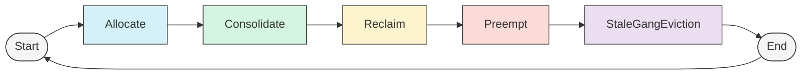

# Scheduler Actions Framework Documentation

## Overview
The scheduler uses an action-based system to make scheduling decisions. At a high level, actions generate scenarios, which are simulated and validated before being committed to the cluster. This allows for complex scheduling logic while maintaining consistency and allowing rollback of failed operations, without needlessly interrupting pods.

## Scheduling Actions

1. **Allocate**
   - Primary action that attempts to allocate pending pods to available nodes
   - Uses scoring functions to find optimal placement for pods
   - Executed first to handle pods that can be scheduled without interference

2. **Consolidate**
   - Consolidates workloads to minimize resource fragmentation
   - Moves pods from lightly loaded nodes to better utilize cluster resources
   - Improves bin-packing and energy efficiency
   - Executed after basic allocation to optimize existing placements
   - Does not commit scenario unless all evicted pods have somewhere to re-locate to

3. **Reclaim**
   - Reclaims borrowed resources between different queues
   - Strives for fair allocation of resources in the cluster (according to the plugins restrictions)

4. **Preempt**
   - Prioritize jobs in-queues
   - Evicts lower-priority jobs in-queue in favor of higher-priority jobs (according to plugin restrictions)

5. **StaleGangEviction**
   - Evicts jobs which violate their minMember gang requirements
   - Prevents deadlocks in the cluster by enforcing gang-scheduling
   - Allows grace period for jobs to recover their gang requirements

### Action Execution Order

Actions are executed in a specific order designed to minimize disruption:



1. **Allocate** - Attempt regular scheduling first with no disruption
2. **Consolidate** - Optimize placements with no permanent evictions
3. **Reclaim** - Recover resource borrowing between queues
4. **Preempt** - Priority-based preemption between jobs of the same queue
5. **StaleGangEviction** - Clean up gang jobs with not enough running pods to prevent deadlocks in the cluster

This sequence ensures that disruptive actions are only performed when necessary, and the least disruptive options are tried first.

## High-Level Concepts

### 1. Scenarios

Scenarios represent hypothetical scheduling states used to model and evaluate potential scheduling decisions.

**Key components:**
- **ByNodeScenario**: A snapshot of potential pod placements across nodes
- **PodAccumulatedScenarioBuilder**: Constructs progressively more complex scenarios
- **Scenario Filters**: Validates scenarios against constraints. Used as an optimization to rule out scenarios early, before performing time consuming simulations

Scenarios allow the scheduler to:
- Model what-if placement situations
- Evaluate resource availability after potential changes
- Test complex scheduling operations before committing them

### 2. Simulation

Simulations are used to check potential scheduling decisions. For example, before evicting some victim jobs to allow another job to be scheduled, we want to make sure that the allocation will succeed according to all scheduling considerations (for example - avaliable resources, pod/node affinity, availability of volumes/dynamic resources on the node, queue fair share, queue limits etc).  
The scheduler can perform virtual scheduling decisions in-memory, such as allocation or eviction of pods, and check the result. Plugins can register callbacks to these operations, to track virtual changes in the cluster's state. If a set of allocation is considered undesirable by the scheduler, it can be rolled back partially or completely.

### 3. Statement

The Statement object represents a transaction-like grouping of scheduling operations that can be committed or rolled back as a unit. Statement is used to simulate scheduling scenarios, without commiting them to the cluster.

**Key capabilities:**
- **Checkpoint/Rollback**: Create points to roll back to if operations fail
- **Operation Tracking**: Maintains an ordered list of operations
- **Resource Consistency**: Manages resource bookkeeping during operations

Important operations:
```go
stmt.Checkpoint()          // Create a rollback point
stmt.Rollback(checkpoint)  // Return to a previous state
stmt.Allocate(pod, node)   // Virtually allocate a pod to a node
stmt.Evict(pod, msg)       // Virtually evict a pod from a node
stmt.Pipeline(pod, node)   // Pipeline a pod to a node (allocate on resources pending eviction)
stmt.Commit()              // Apply all changes to the cluster
stmt.Discard()             // Discard all changes
```

This documentation covers the main concepts of the scheduler's action framework. For more detailed information about specific implementations or advanced features, please refer to the codebase and tests. Requests and suggestions are welcome.