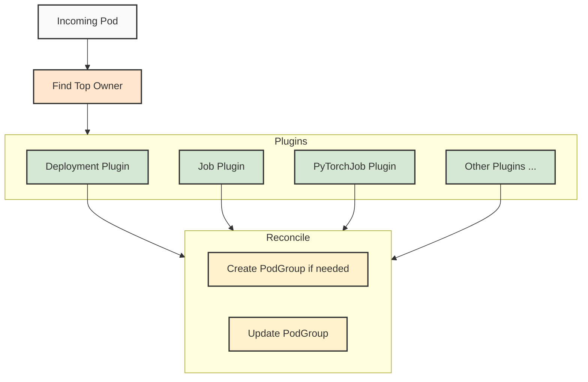

# Pod Grouper

## Overview
The Pod Grouper is a component responsible for automatically creating and managing PodGroup resources based on incoming pods. It implements a plugin-based architecture to support different grouping strategies for various workload types. The core function of the Pod Grouper is to ensure that pods belonging to the same logical workload are properly grouped together for gang-scheduling purposes.

### Background: Gang Scheduling
Gang scheduling is a scheduling strategy where a group of related pods must either be scheduled together or not at all. This is crucial for distributed workloads like:

- Machine learning training jobs that require multiple workers to start simultaneously
- Distributed data processing tasks that need all components to be available
- HPC applications that require synchronized startup of all processes

Without gang scheduling, individual pods might be scheduled at different times, leading to resource inefficiency, deadlocks, or application failures.

## PodGroup CRD
The Pod Grouper uses the PodGroup Custom Resource Definition (CRD) to represent a group of related pods that should be scheduled together. This CRD includes:

- `MinMember`: The minimum number of pods that must be scheduled together
- `Queue`: The queue to which the workload belongs
- Scheduling and resource status information
- Phase and condition tracking for the group's lifecycle

While users or third-party tools can manually create PodGroup resources, the Pod Grouper automates this process by analyzing incoming pods and applying appropriate grouping logic based on the pod's characteristics and ownership.

## Plugin Architecture
The Pod Grouper uses a plugin-based architecture similar to the scheduler's plugin framework. Each plugin implements specific grouping logic for different types of workloads:



### Top Owner Identification
The Pod Grouper identifies the topmost owner of each pod by traversing its owner references. This allows the system to:

1. Group pods that belong to the same parent workload
2. Apply consistent grouping logic based on the parent workload type
3. Handle complex ownership hierarchies (e.g., ReplicaSets owned by Deployments)

For example, a pod created by a ReplicaSet that's part of a Deployment would be grouped based on the Deployment's characteristics rather than the ReplicaSet's.

#### Skipping Top Owner
In some cases, the top owner might not be the appropriate level for grouping. The Pod Grouper supports a "skip top owner" pattern where the second-highest owner is used for grouping instead. This is useful for:
* Multi-tiered deployments
* Custom controllers that delegate to standard Kubernetes resources
* Cases where the topmost owner doesn't contain the relevant scheduling information  

For example, with Argo Workflows, the pod-grouper does not use the topmost Argo Workflow as the grouping key. If an Argo Workflow creates a PyTorch job, the pod-grouper will group the pods according to the PyTorch job specifications rather than the Argo Workflow. This ensures that specialized workloads maintain their appropriate gang-scheduling characteristics even when launched through workflow orchestration systems.
This ability to "look through" orchestration layers allows the pod-grouper to maintain consistent grouping logic across deployment methods, whether a job is created directly or through automation tools.


## Grouping Logic Examples

### Job/BatchJob Grouping
For Job resources, the Pod Grouper:
- Creates a PodGroup matching the Job's identity
- Sets MinMember to 1 by default - native k8s batch jobs usually do not require gang scheduling
- Sets the priority class of the PodGroup to "Train", to allow it to go over-quota

### Deployment Grouping
Deployments are a special case:
- A Pod Group is created per pod of the deployment
- Default priority class for deployments is "Inference", as that's the usual use case for them

### MPI Job Grouping
For MPI workloads:
- Infer gang scheduling requirements from  schedulingPolicy.minAvailable, otherwise use all the replicas
- Use "Train" priority class by default

### Pod Grouping
For pods with no owner, a "Train"-priority PodGroup with MinMember=1 is created.

### Overriding default priority class
While priority class is inferred from the workload types, this default can usually be overridden by using labels: adding the `priorityClassName` on the Top Owner, or the Pod itself, will override whatever default is used for the workload.

## PodGroup CRD Documentation

The PodGroup CRD includes the following key fields:

### Spec Fields
- `minMember`: Minimum number of pods required for scheduling
- `queue`: Queue name for resource allocation
- `priorityClassName`: Priority of the PodGroup
- `markUnschedulable`: Whether to mark pods as unschedulable after failed scheduling attempts
- `schedulingBackoff`: Number of cycles before marking the podgroup as unschedulable. Currently supports only 1 or -1 (no backoff)

### Unschedulable Explanations
The PodGroup CRD includes detailed explanations when jobs cannot be scheduled, including:
- Resource quota details
- Queue limits and usage
- Requested vs. available resources
- Preemptible vs. non-preemptible resource information

This structured information helps users and automation systems understand and respond to scheduling failures.
 ## Example Plugin

``` Go
// CustomJobPodGroupPlugin implements grouping logic for custom job resources
func CustomJobPodGroupMetadata(topOwner *unstructured.Unstructured, pod *v1.Pod, otherOwners ...*metav1.PartialObjectMetadata) (*podgroup.Metadata, error) {
	// It's useful to use the default implementation to get the default metadata,
	// and then override the fields that are specific to custom jobs.
	podGroupMetadata, err := plugins.GetPodGroupMetadata(topOwner, pod)
	if err != nil {
		return nil, err
	}

	// Extract minAvailable from the spec if it exists
	minAvailable, found, err := unstructured.NestedInt64(topOwner.Object, "spec", "minAvailable")
	if err != nil {
		return nil, fmt.Errorf("error extracting minAvailable from spec: %w", err)
	}

	// Override the minMember if minAvailable was found
	if found && minAvailable > 0 {
		podGroupMetadata.MinAvailable = int32(minAvailable)
		return podGroupMetadata, nil
	}

	// Fallback to replicas field if minAvailable is not set
	replicas, found, err := unstructured.NestedInt64(topOwner.Object, "spec", "replicas")
	if err != nil {
		return nil, fmt.Errorf("error extracting replicas from spec: %w", err)
	}

	if found && replicas > 0 {
		podGroupMetadata.MinAvailable = int32(replicas)
		return podGroupMetadata, nil
	}

	// Otherwise keep the default minMember from the default implementation
	return podGroupMetadata, nil
}
```

To register your plugin, edit `pkg/podgrouper/podgrouper/supported_types/supported_types.go` and add the following entry to the supportedTypes slice:
``` Go 
table := supportedTypes{
    {
        Group:   "example.com",
        Version: "v1",
        Kind:    "CustomJob",
    }: custom.CustomJobPodGroupMetadata,
    ...
}
```